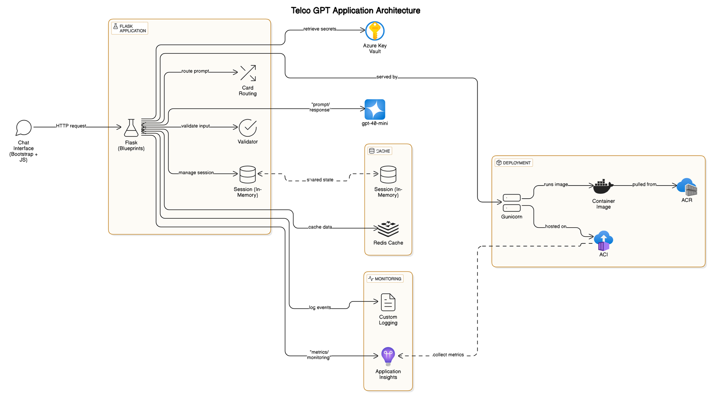
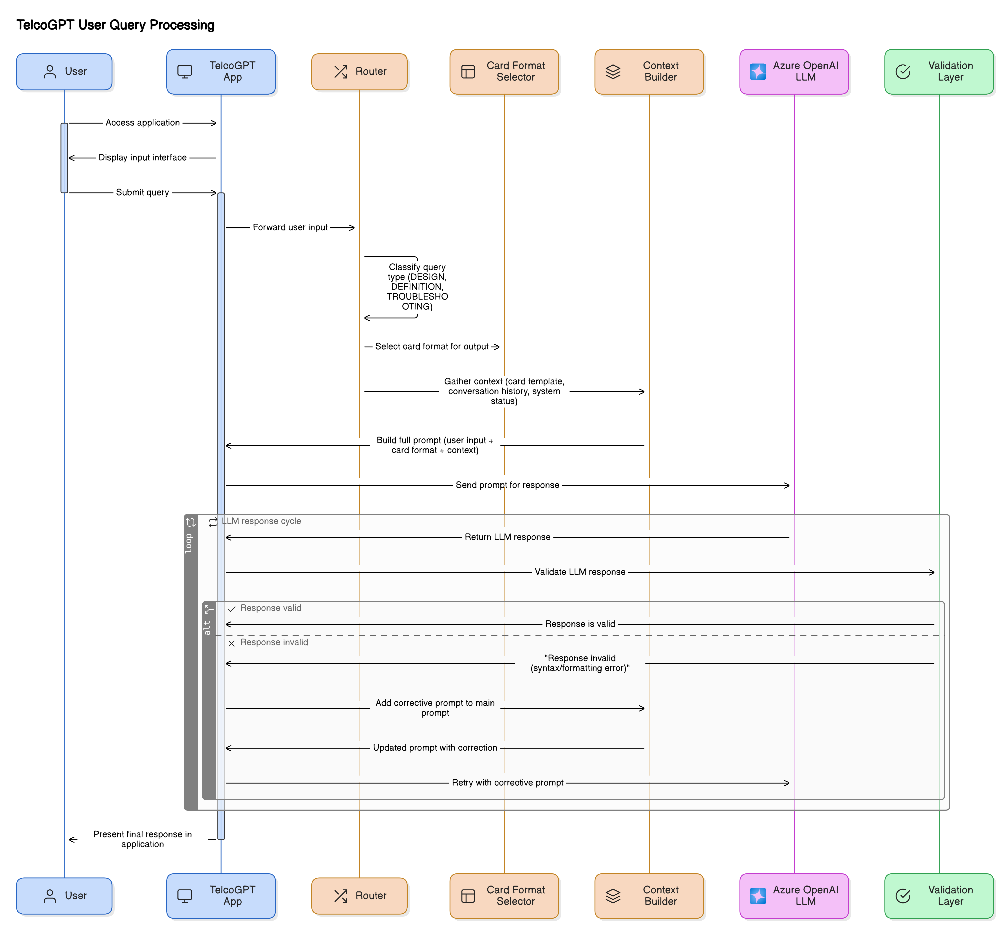

# TelcoGPT – Prompt‑Only Telecom Q\&A Assistant

> **Version 1.0** · MAY 2025

> Lean Flask application that wraps an Azure OpenAI GPT‑4o deployment and responds in telecom‑specific “card” layouts.

---

## 1 Project Overview

TelcoGPT delivers instant, domain‑accurate answers for network engineers and support teams without maintaining an external knowledge base. It relies purely on **prompt engineering**, three fixed answer templates (Definition / Troubleshooting / Design Recommendation), and a minimal Python Flask backend.

* **Language model:** *Azure OpenAI GPT‑4o mini* (2024‑07‑18).
* **Backend:** Flask 3.x with Redis (optional, for chat history).
* **Frontend:** Single‑page Bootstrap chat UI.

---

## 2 Prerequisites

| Requirement            | Notes                                                |
| ---------------------- | ---------------------------------------------------- |
| **Azure subscription** | Contributor rights to create Cognitive resources.    |
| **Local tooling**      | `az CLI`, `git`, `python 3.11+`, `pip`, `jq`.        |
| **OS**                 | Linux, macOS, or Windows 10+ with WSL‑2 recommended. |

---

## 3 Provision Azure OpenAI Resources





Execute the following **once**; substitute your own names where indicated:

```bash
# ✧ Login ✧
az login                       # interactive browser auth

# ✧ Create the Cognitive account ✧
az cognitiveservices account create \
    --name <myResourceName> \
    --resource-group Tredence-Batch1 \
    --location eastus \
    --kind OpenAI \
    --sku s0

# ✧ Fetch the endpoint URL ✧
az cognitiveservices account show \
    --name <myResourceName> \
    --resource-group Tredence-Batch1 \
  | jq -r .properties.endpoint

# ✧ Fetch the primary key ✧
az cognitiveservices account keys list \
    --name <myResourceName> \
    --resource-group Tredence-Batch1 \
  | jq -r .key1

```
### Launch VS code by using the command line
```
code
```
- Creaet a folder "telcogpt" on your desktop and open it in VS Code.

- create a file named .env and store below environment variables in it.

```
AZURE_OPENAI_ENDPOINT="https://<myResourceName>.openai.azure.com/"
AZURE_OPENAI_API_KEY="<primary‑key>"

```


```

# ✧ Deploy the GPT‑4o mini model ✧
az cognitiveservices account deployment create \
    --name <myResourceName> \
    --resource-group Tredence-Batch1 \
    --deployment-name telcogpt \
    --model-name gpt-4o-mini \
    --model-version "2024-07-18" \
    --model-format OpenAI \
    --sku-capacity 1 \
    --sku-name Standard
```

> **Considerations**
>
> * **Quota:** A Standard SKU provides 1 compute unit; API requests above the quota will be throttled.
> * **Naming rules:** Resource names must be globally unique and 2–24 characters.
> * **Azure CLI vs PowerShell:** The above commands run in Bash or PowerShell Core. Ensure `jq` is installed for JSON parsing.

---

## 4 Local Environment Setup

```bash
# 1 Navigate (example path)
cd ~/Desktop/TelcoGPT

# 2 Create a Python virtual‑env
python -m venv gen-ai && source gen-ai/bin/activate

# 3 Create folders & install deps
mkdir -p app/static app/templates prompts
pip install flask redis openai pytest

# 4 Create placeholder source files
 touch app/__init__.py app/routes.py app/cards.py \
       app/prompt_builder.py app/validator.py

# 5 Create the system prompt
 touch prompts/system_prompt.txt          
```

---

## 5 Running the App Locally

```bash
flask --app app run               # defaults to http://127.0.0.1:5000
```

Visit [http://127.0.0.1:5000/](http://127.0.0.1:5000/) to open the chat UI. Test with:

```bash
curl -s http://127.0.0.1:5000/chat \
  -H "Content-Type: application/json" \
  -d '{"message":"error code P0610 on eNB 410"}' | jq .
```

Expected JSON response contains five numbered bullets under the *Troubleshooting* card layout.

---
---

## 5 Running the App Locally

```bash
flask --app app run               # defaults to http://127.0.0.1:5000
```

Visit [http://127.0.0.1:5000/](http://127.0.0.1:5000/) to open the chat UI. Test with:

```bash
curl -s http://127.0.0.1:5000/chat \
  -H "Content-Type: application/json" \
  -d '{"message":"error code P0610 on eNB 410"}' | jq .
```

Expected JSON response contains five numbered bullets under the *Troubleshooting* card layout.


## Containerization

```bash
pip install pipreqs
pipreqs . --force --ignore .env,venv,gen-ai --skip .git --print
---

```bash
# ------------------------------------------------------------------
# 0.  Variable block –  set ONCE for copy‑paste convenience
# ------------------------------------------------------------------
RG=Tredence-Batch1                  # resource‑group name
LOCATION=centralindia               # Azure region
ACR=telcogptacranshu              # must be globally unique
IMG=telcogpt:v1                   # repository name inside ACR
ACI=telcogpt-aci                    # container‑group name
PORT=8080                             # gunicorn listens here

AOAI_ENDPOINT=https://swedencentral.api.cognitive.microsoft.com/
AOAI_KEY=b249ff7055e349c19b9665ff4df191ec


# ------------------------------------------------------------------
# ------------------------------------------------------------------
# 1.  Create Azure Container Registry and test the app locally
# ------------------------------------------------------------------


# create container registry
az acr create -g $RG -n $ACR --sku Basic --admin-enabled true

# 1. test the app with gunicorn locally (optional)
gunicorn -b 127.0.0.1:8080 app:"create_app()" -e AZURE_OPENAI_ENDPOINT=$AOAI_ENDPOINT -e AZURE_OPENAI_API_KEY=$AOAI_KEY

# ------------------------------------------------------------------


# ------------------------------------------------------------------
# 2.  Build the image locally
# ------------------------------------------------------------------

# 2 Build a docker container locally and test the container locally
# Build docker image locally
sudo docker build -t $IMG .
# check the list of images
sudo docker images -a
# run the image locally
sudo docker run -d -p 8080:8080 -e AZURE_OPENAI_API_KEY=$AOAI_KEY -e AZURE_OPENAI_ENDPOINT=$AOAI_ENDPOINT $IMG

# check the list of running containers
sudo docker ps -a
# check the logs of the container
sudo docker logs telcogpt:v1 # if needed replace with the container id
# navigate to the browser and check the app is running on localhost:8080 / 127.0.0.1:8080

# ------------------------------------------------------------------

# ------------------------------------------------------------------
# 3.  Tag & push the image to ACR
# ------------------------------------------------------------------

# 2 Push the docker image to the container registry
sudo az acr login -n $ACR -u $(az acr credential show -n $ACR --query username -o tsv) \
  -p $(az acr credential show -n $ACR --query passwords[0].value -o tsv)

sudo docker tag $IMG $ACR.azurecr.io/$IMG
# push the image to the container registry
sudo docker push $ACR.azurecr.io/telcogpt:v1
# check the list of images in the container registry
az acr repository list -n $ACR -o table


#  (optional) Build the image in Azure Container Registry (ACR)
# This is an alternative to building locally and pushing the image.
# az acr build -t $IMG -r $ACR .


# ------------------------------------------------------------------
# ------------------------------------------------------------------
# 4.  Deploy Azure Container Instance (public IP + DNS label)
# ------------------------------------------------------------------

#  run container with the MI & env vars
az container create -g $RG -n $ACI \
  --image $ACR.azurecr.io/$IMG \
  --registry-login-server $ACR.azurecr.io \
  --registry-username $(az acr credential show -n $ACR --query username -o tsv) \
  --registry-password $(az acr credential show -n $ACR --query passwords[0].value -o tsv) \
  --cpu 1 --memory 1 --ports 8080 --os-type Linux --ip-address public \
  --dns-name-label telcogpt-demo \
  --environment-variables \
      AZURE_OPENAI_ENDPOINT=$AOAI_ENDPOINT \
      AZURE_OPENAI_API_KEY=$AOAI_KEY \

# Key switches:
#   --ip-address public      → allocate public IP
#   --ports $PORT            → expose container port externally
#   --dns-name-label …       → optional friendly FQDN
#   env vars                 → pass model endpoint + key to Flask app

# check list of containers
az container list -g $RG -o table


# ------------------------------------------------------------------
# 5.  Retrieve the public URL
# ------------------------------------------------------------------
az container show -g $RG -n $ACI \
  --query "ipAddress.{fqdn:fqdn,ip:ip,ports:ports}" -o table


# Sample output
# fqdn                                   ip            ports
# -------------------------------------  ------------- -----
# telcogpt-demo-9475.eastus.azurecontainer.io 20.42.11.111  8080

# Browse:
#   http://telcogpt-demo-9475.eastus.azurecontainer.io:8080/
# or http://<ip>:8080/

# ------------------------------------------------------------------
# 6.  (Optional) View logs / exec shell
# ------------------------------------------------------------------
az container logs -g $RG -n $ACI --tail 50 --follow          # stream logs
az container exec  -g $RG -n $ACI --exec-command "/bin/sh"    # debug shell

# ------------------------------------------------------------------


# ------------------------------------------------------------------
# 7.  Delete and Clean the deployments 
# ------------------------------------------------------------------

# delete the container instance
az container delete -g $RG -n $ACI --yes

# delete the container registry
az acr delete -g $RG -n $ACR --yes


```

© 2025 Blue Data Consulting – All rights reserved.

